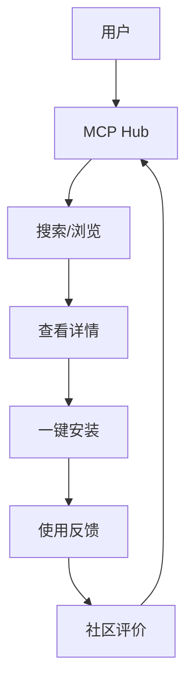

# 🔌 MCP Hub - MCP工具发现平台

<div align="center">

**[English](README_EN.md)** | **中文**


*发现、分享、使用MCP服务器的一站式平台*

</div>

---

## 📖 目录

- [项目简介](#项目简介)
- [为什么需要MCP Hub](#为什么需要mcp-hub)
- [核心功能](#核心功能)
- [快速开始](#快速开始)
- [技术架构](#技术架构)
- [API文档](#api文档)
- [贡献指南](#贡献指南)
- [路线图](#路线图)
- [许可证](#许可证)

---

## 🎯 项目简介

MCP Hub是一个开源的MCP工具发现平台，旨在帮助开发者快速找到、评估和使用MCP（Model Context Protocol）服务器。

### 解决的问题

- **发现困难**：不知道有哪些MCP服务器可用
- **选择迷茫**：不清楚哪个MCP服务器适合自己
- **配置复杂**：MCP服务器安装和配置门槛高
- **质量参差**：没有统一的评价标准

### 核心价值

- 🔍 **智能搜索**：按场景、功能、兼容性搜索
- ⭐ **社区评分**：真实的用户评价和使用反馈
- 🚀 **一键安装**：简化MCP服务器的安装配置
- 📊 **对比分析**：多维度对比不同MCP服务器

---

## 🤔 为什么需要MCP Hub

### 痛点分析

#### 1. 信息过载
- GitHub上MCP服务器数量快速增长
- 没有统一的分类和索引
- 文档质量参差不齐

#### 2. 选择困难
- 不清楚哪个MCP服务器适合自己的场景
- 缺少真实的性能对比数据
- 兼容性信息不透明

#### 3. 配置复杂
- 每个MCP服务器的安装方式不同
- 环境依赖和配置参数各异
- 缺少一键部署方案

### 解决方案

MCP Hub提供：
- ✅ 统一的MCP服务器目录
- ✅ 智能推荐和场景匹配
- ✅ 社区驱动的评价体系
- ✅ 自动化安装和配置

---

## 🚀 核心功能

### 1. MCP服务器目录



#### 分类体系
- **开发工具**：代码分析、测试、部署
- **数据处理**：数据库、API、文件系统
- **AI增强**：模型调用、提示词管理
- **生产力**：日历、邮件、任务管理
- **通讯集成**：Slack、Discord、微信

### 2. 智能推荐

#### 推荐算法
```python
def recommend_mcp_servers(user_needs):
    # 1. 需求分析
    requirements = analyze_requirements(user_needs)
    
    # 2. 匹配度计算
    scores = calculate_match_scores(requirements)
    
    # 3. 社区权重
    community_scores = get_community_scores()
    
    # 4. 综合排序
    final_scores = combine_scores(scores, community_scores)
    
    return sort_by_score(final_scores)
```

#### 推荐因素
- **功能匹配**：需求与MCP服务器功能的匹配度
- **社区评价**：用户评分、使用量、Star数
- **兼容性**：与用户环境的兼容程度
- **活跃度**：维护频率、Issue响应速度

### 3. 一键安装

#### 安装流程
```bash
# 搜索MCP服务器
mcp-hub search "database"

# 查看详情
mcp-hub info mcp-server-postgres

# 一键安装
mcp-hub install mcp-server-postgres

# 自动配置
mcp-hub configure mcp-server-postgres --env production
```

#### 支持的安装方式
- **npm/pip**：包管理器安装
- **Docker**：容器化部署
- **源码**：从源码构建
- **二进制**：预编译二进制文件

### 4. 社区评价

#### 评价维度
- **功能完整性**：功能是否满足需求
- **性能表现**：响应速度、资源占用
- **文档质量**：文档是否清晰完整
- **维护状态**：更新频率、Issue处理
- **易用性**：安装配置是否简单

#### 评价格式
```json
{
  "server_id": "mcp-server-postgres",
  "user_id": "user123",
  "rating": 4.5,
  "review": "功能强大，性能优秀，文档清晰",
  "use_case": "数据分析",
  "pros": ["支持复杂查询", "性能优秀"],
  "cons": ["配置稍复杂"],
  "would_recommend": true
}
```

---

## 🛠️ 快速开始

### 环境要求

- Node.js 18+
- npm 或 yarn
- Git

### 安装MCP Hub CLI

```bash
# 全局安装
npm install -g mcp-hub

# 或使用yarn
yarn global add mcp-hub
```

### 基本使用

#### 搜索MCP服务器

```bash
# 按关键词搜索
mcp-hub search "database"

# 按分类搜索
mcp-hub search --category "开发工具"

# 按功能搜索
mcp-hub search --feature "支持PostgreSQL"
```

#### 查看详情

```bash
# 查看MCP服务器详情
mcp-hub info mcp-server-postgres

# 查看兼容性信息
mcp-hub info mcp-server-postgres --compatibility

# 查看社区评价
mcp-hub info mcp-server-postgres --reviews
```

#### 安装和配置

```bash
# 安装MCP服务器
mcp-hub install mcp-server-postgres

# 配置环境变量
mcp-hub configure mcp-server-postgres --env DATABASE_URL=postgresql://localhost:5432/mydb

# 启动服务
mcp-hub start mcp-server-postgres
```

### 配置文件

```json
{
  "mcpServers": {
    "postgres": {
      "command": "npx",
      "args": ["-y", "@modelcontextprotocol/server-postgres"],
      "env": {
        "DATABASE_URL": "postgresql://localhost:5432/mydb"
      }
    }
  }
}
```

---

## 🏗️ 技术架构

### 系统架构

```
┌─────────────────────────────────────────────────────────────┐
│                      MCP Hub Frontend                       │
│                    (Next.js + React)                        │
├─────────────────────────────────────────────────────────────┤
│                      MCP Hub API                            │
│                  (Node.js + Express)                        │
├─────────────────────────────────────────────────────────────┤
│                    MCP Hub Core                             │
│         (搜索/推荐/安装/配置/评价)                           │
├─────────────────────────────────────────────────────────────┤
│                    Data Layer                               │
│              (PostgreSQL + Redis + S3)                      │
└─────────────────────────────────────────────────────────────┘
```

### 技术栈

#### 前端
- **框架**：Next.js 14 + React 18
- **UI库**：Tailwind CSS + shadcn/ui
- **状态管理**：Zustand
- **数据获取**：React Query

#### 后端
- **运行时**：Node.js 20
- **框架**：Express.js
- **数据库**：PostgreSQL 15
- **缓存**：Redis 7
- **搜索**：Elasticsearch

#### 基础设施
- **容器化**：Docker + Docker Compose
- **CI/CD**：GitHub Actions
- **云服务**：Vercel (前端) + Railway (后端)

### 数据库设计

#### MCP服务器表
```sql
CREATE TABLE mcp_servers (
  id VARCHAR(50) PRIMARY KEY,
  name VARCHAR(100) NOT NULL,
  description TEXT,
  author VARCHAR(100),
  repository VARCHAR(255),
  category VARCHAR(50),
  tags TEXT[],
  install_command TEXT,
  config_template JSONB,
  compatibility JSONB,
  created_at TIMESTAMP DEFAULT NOW(),
  updated_at TIMESTAMP DEFAULT NOW()
);
```

#### 用户评价表
```sql
CREATE TABLE reviews (
  id SERIAL PRIMARY KEY,
  server_id VARCHAR(50) REFERENCES mcp_servers(id),
  user_id VARCHAR(100),
  rating DECIMAL(2,1),
  review TEXT,
  use_case VARCHAR(100),
  pros TEXT[],
  cons TEXT[],
  would_recommend BOOLEAN,
  created_at TIMESTAMP DEFAULT NOW()
);
```

---

## 📚 API文档

### 搜索API

#### 搜索MCP服务器
```http
GET /api/v1/servers/search?q={query}&category={category}&page={page}
```

**响应示例：**
```json
{
  "success": true,
  "data": {
    "servers": [
      {
        "id": "mcp-server-postgres",
        "name": "PostgreSQL MCP Server",
        "description": "PostgreSQL数据库的MCP服务器实现",
        "author": "ModelContextProtocol",
        "category": "数据库",
        "rating": 4.5,
        "install_count": 12500
      }
    ],
    "total": 150,
    "page": 1,
    "per_page": 20
  }
}
```

### 详情API

#### 获取服务器详情
```http
GET /api/v1/servers/{server_id}
```

**响应示例：**
```json
{
  "success": true,
  "data": {
    "id": "mcp-server-postgres",
    "name": "PostgreSQL MCP Server",
    "description": "PostgreSQL数据库的MCP服务器实现",
    "author": "ModelContextProtocol",
    "repository": "https://github.com/modelcontextprotocol/server-postgres",
    "category": "数据库",
    "tags": ["postgresql", "database", "sql"],
    "install_command": "npx -y @modelcontextprotocol/server-postgres",
    "config_template": {
      "command": "npx",
      "args": ["-y", "@modelcontextprotocol/server-postgres"],
      "env": {
        "DATABASE_URL": "postgresql://localhost:5432/mydb"
      }
    },
    "compatibility": {
      "node": ">=18",
      "os": ["linux", "macos", "windows"]
    },
    "rating": 4.5,
    "review_count": 128,
    "install_count": 12500,
    "created_at": "2024-11-01T00:00:00Z",
    "updated_at": "2026-05-20T00:00:00Z"
  }
}
```

### 安装API

#### 安装MCP服务器
```http
POST /api/v1/servers/{server_id}/install
```

**请求体：**
```json
{
  "method": "npm",
  "env": {
    "DATABASE_URL": "postgresql://localhost:5432/mydb"
  }
}
```

**响应示例：**
```json
{
  "success": true,
  "data": {
    "installation_id": "inst_123",
    "status": "installing",
    "message": "正在安装 mcp-server-postgres..."
  }
}
```

---

## 🤝 贡献指南

### 如何贡献

1. **Fork** 本仓库
2. **创建** 特性分支：`git checkout -b feature/your-feature`
3. **提交** 更改：`git commit -m 'Add your feature'`
4. **推送** 分支：`git push origin feature/your-feature`
5. **创建** Pull Request

### 贡献类型

- 📝 **文档改进**：完善文档、添加示例
- 🐛 **Bug修复**：修复已知问题
- ✨ **新功能**：添加新的MCP服务器或功能
- 📊 **数据更新**：更新MCP服务器信息
- 🌐 **翻译支持**：添加多语言支持
- 🧪 **测试**：添加测试用例

### 开发环境设置

```bash
# 克隆仓库
git clone https://github.com/Miku-cy/mcp-hub.git
cd mcp-hub

# 安装依赖
npm install

# 启动开发服务器
npm run dev

# 运行测试
npm test
```

### 代码规范

- **TypeScript**：使用TypeScript开发
- **ESLint**：遵循ESLint配置
- **Prettier**：使用Prettier格式化
- **提交信息**：使用中文或英文

---

## 🗺️ 路线图

### Phase 1 - 基础功能（2026 Q2）

- [x] 项目初始化
- [ ] MCP服务器目录
- [ ] 基础搜索功能
- [ ] 服务器详情页
- [ ] 社区评价系统

### Phase 2 - 智能推荐（2026 Q3）

- [ ] 智能推荐算法
- [ ] 场景匹配引擎
- [ ] 个性化推荐
- [ ] 使用分析报告

### Phase 3 - 一键安装（2026 Q4）

- [ ] 自动化安装工具
- [ ] 配置生成器
- [ ] 环境检测
- [ ] 兼容性验证

### Phase 4 - 社区生态（2027 Q1）

- [ ] 开发者认证
- [ ] 贡献者激励
- [ ] 社区活动
- [ ] 商业合作

---

## 📊 项目状态

- **当前版本**：v0.1.0
- **开发状态**：Alpha
- **许可证**：MIT
- **维护者**：Miku-cy

---

## 🙏 致谢

感谢以下资源的支持：

- [Model Context Protocol](https://modelcontextprotocol.io) - MCP协议规范
- [GitHub](https://github.com) - 代码托管
- [Vercel](https://vercel.com) - 前端部署
- [Railway](https://railway.app) - 后端部署

---

## 📞 联系方式

- **GitHub Issues**：[提交问题](https://github.com/Miku-cy/mcp-hub/issues)
- **Email**：your-email@example.com
- **社区论坛**：[OpenClaw社区](https://clawd.org.cn/forum/)

---

<div align="center">

**⭐ 如果这个项目对你有帮助，请给个Star支持一下！⭐**

**[English](README_EN.md)** | **中文**

</div>
