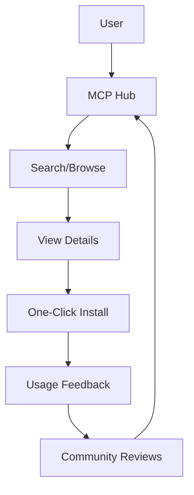

# 🔌 MCP Hub - MCP Tool Discovery Platform

<div align="center">

**[中文](README.md)** | **English**


*One-stop platform for discovering, sharing, and using MCP servers*

</div>

---

## 📖 Table of Contents

- [Introduction](#introduction)
- [Why MCP Hub](#why-mcp-hub)
- [Core Features](#core-features)
- [Quick Start](#quick-start)
- [Technical Architecture](#technical-architecture)
- [API Documentation](#api-documentation)
- [Contributing](#contributing)
- [Roadmap](#roadmap)
- [License](#license)

---

## 🎯 Introduction

MCP Hub is an open-source MCP tool discovery platform designed to help developers quickly find, evaluate, and use MCP (Model Context Protocol) servers.

### Problems Solved

- **Discovery Difficulty**: Don't know which MCP servers are available
- **Selection Confusion**: Unclear which MCP server suits your needs
- **Complex Configuration**: High barrier for MCP server installation and configuration
- **Quality Variance**: No unified evaluation standards

### Core Values

- 🔍 **Smart Search**: Search by scenario, functionality, compatibility
- ⭐ **Community Ratings**: Real user reviews and feedback
- 🚀 **One-Click Install**: Simplified MCP server installation
- 📊 **Comparison Analysis**: Multi-dimensional comparison of different MCP servers

---

## 🤔 Why MCP Hub

### Pain Point Analysis

#### 1. Information Overload
- Rapid growth in MCP server numbers on GitHub
- No unified classification and indexing
- Varying documentation quality

#### 2. Selection Difficulty
- Unclear which MCP server fits your scenario
- Lack of real performance comparison data
- Non-transparent compatibility information

#### 3. Complex Configuration
- Different installation methods for each MCP server
- Various environment dependencies and configuration parameters
- Lack of one-click deployment solutions

### Solutions

MCP Hub provides:
- ✅ Unified MCP server directory
- ✅ Smart recommendations and scenario matching
- ✅ Community-driven evaluation system
- ✅ Automated installation and configuration

---

## 🚀 Core Features

### 1. MCP Server Directory



#### Classification System
- **Development Tools**: Code analysis, testing, deployment
- **Data Processing**: Databases, APIs, file systems
- **AI Enhancement**: Model calls, prompt management
- **Productivity**: Calendar, email, task management
- **Communication Integration**: Slack, Discord, WeChat

### 2. Smart Recommendations

#### Recommendation Algorithm
```python
def recommend_mcp_servers(user_needs):
    # 1. Requirement Analysis
    requirements = analyze_requirements(user_needs)
    
    # 2. Match Score Calculation
    scores = calculate_match_scores(requirements)
    
    # 3. Community Weight
    community_scores = get_community_scores()
    
    # 4. Comprehensive Ranking
    final_scores = combine_scores(scores, community_scores)
    
    return sort_by_score(final_scores)
```

#### Recommendation Factors
- **Feature Match**: Match between requirements and MCP server features
- **Community Ratings**: User ratings, usage count, Star count
- **Compatibility**: Compatibility with user environment
- **Activity**: Maintenance frequency, Issue response speed

### 3. One-Click Installation

#### Installation Flow
```bash
# Search MCP servers
mcp-hub search "database"

# View details
mcp-hub info mcp-server-postgres

# One-click install
mcp-hub install mcp-server-postgres

# Auto-configure
mcp-hub configure mcp-server-postgres --env production
```

#### Supported Installation Methods
- **npm/pip**: Package manager installation
- **Docker**: Containerized deployment
- **Source**: Build from source
- **Binary**: Pre-compiled binary files

### 4. Community Reviews

#### Review Dimensions
- **Feature Completeness**: Does the feature meet requirements
- **Performance**: Response speed, resource usage
- **Documentation Quality**: Is documentation clear and complete
- **Maintenance Status**: Update frequency, Issue handling
- **Ease of Use**: Is installation and configuration simple

#### Review Format
```json
{
  "server_id": "mcp-server-postgres",
  "user_id": "user123",
  "rating": 4.5,
  "review": "Powerful features, excellent performance, clear documentation",
  "use_case": "Data Analysis",
  "pros": ["Supports complex queries", "Excellent performance"],
  "cons": ["Configuration slightly complex"],
  "would_recommend": true
}
```

---

## 🛠️ Quick Start

### Requirements

- Node.js 18+
- npm or yarn
- Git

### Install MCP Hub CLI

```bash
# Global installation
npm install -g mcp-hub

# Or use yarn
yarn global add mcp-hub
```

### Basic Usage

#### Search MCP Servers

```bash
# Search by keyword
mcp-hub search "database"

# Search by category
mcp-hub search --category "Development Tools"

# Search by feature
mcp-hub search --feature "PostgreSQL support"
```

#### View Details

```bash
# View MCP server details
mcp-hub info mcp-server-postgres

# View compatibility info
mcp-hub info mcp-server-postgres --compatibility

# View community reviews
mcp-hub info mcp-server-postgres --reviews
```

#### Install and Configure

```bash
# Install MCP server
mcp-hub install mcp-server-postgres

# Configure environment variables
mcp-hub configure mcp-server-postgres --env DATABASE_URL=postgresql://localhost:5432/mydb

# Start service
mcp-hub start mcp-server-postgres
```

### Configuration File

```json
{
  "mcpServers": {
    "postgres": {
      "command": "npx",
      "args": ["-y", "@modelcontextprotocol/server-postgres"],
      "env": {
        "DATABASE_URL": "postgresql://localhost:5432/mydb"
      }
    }
  }
}
```

---

## 🏗️ Technical Architecture

### System Architecture

```
┌─────────────────────────────────────────────────────────────┐
│                      MCP Hub Frontend                       │
│                    (Next.js + React)                        │
├─────────────────────────────────────────────────────────────┤
│                      MCP Hub API                            │
│                  (Node.js + Express)                        │
├─────────────────────────────────────────────────────────────┤
│                    MCP Hub Core                             │
│         (Search/Recommend/Install/Configure/Review)         │
├─────────────────────────────────────────────────────────────┤
│                    Data Layer                               │
│              (PostgreSQL + Redis + S3)                      │
└─────────────────────────────────────────────────────────────┘
```

### Tech Stack

#### Frontend
- **Framework**: Next.js 14 + React 18
- **UI Library**: Tailwind CSS + shadcn/ui
- **State Management**: Zustand
- **Data Fetching**: React Query

#### Backend
- **Runtime**: Node.js 20
- **Framework**: Express.js
- **Database**: PostgreSQL 15
- **Cache**: Redis 7
- **Search**: Elasticsearch

#### Infrastructure
- **Containerization**: Docker + Docker Compose
- **CI/CD**: GitHub Actions
- **Cloud Services**: Vercel (Frontend) + Railway (Backend)

### Database Design

#### MCP Servers Table
```sql
CREATE TABLE mcp_servers (
  id VARCHAR(50) PRIMARY KEY,
  name VARCHAR(100) NOT NULL,
  description TEXT,
  author VARCHAR(100),
  repository VARCHAR(255),
  category VARCHAR(50),
  tags TEXT[],
  install_command TEXT,
  config_template JSONB,
  compatibility JSONB,
  created_at TIMESTAMP DEFAULT NOW(),
  updated_at TIMESTAMP DEFAULT NOW()
);
```

#### Reviews Table
```sql
CREATE TABLE reviews (
  id SERIAL PRIMARY KEY,
  server_id VARCHAR(50) REFERENCES mcp_servers(id),
  user_id VARCHAR(100),
  rating DECIMAL(2,1),
  review TEXT,
  use_case VARCHAR(100),
  pros TEXT[],
  cons TEXT[],
  would_recommend BOOLEAN,
  created_at TIMESTAMP DEFAULT NOW()
);
```

---

## 📚 API Documentation

### Search API

#### Search MCP Servers
```http
GET /api/v1/servers/search?q={query}&category={category}&page={page}
```

**Response Example:**
```json
{
  "success": true,
  "data": {
    "servers": [
      {
        "id": "mcp-server-postgres",
        "name": "PostgreSQL MCP Server",
        "description": "MCP server implementation for PostgreSQL database",
        "author": "ModelContextProtocol",
        "category": "Database",
        "rating": 4.5,
        "install_count": 12500
      }
    ],
    "total": 150,
    "page": 1,
    "per_page": 20
  }
}
```

### Details API

#### Get Server Details
```http
GET /api/v1/servers/{server_id}
```

**Response Example:**
```json
{
  "success": true,
  "data": {
    "id": "mcp-server-postgres",
    "name": "PostgreSQL MCP Server",
    "description": "MCP server implementation for PostgreSQL database",
    "author": "ModelContextProtocol",
    "repository": "https://github.com/modelcontextprotocol/server-postgres",
    "category": "Database",
    "tags": ["postgresql", "database", "sql"],
    "install_command": "npx -y @modelcontextprotocol/server-postgres",
    "config_template": {
      "command": "npx",
      "args": ["-y", "@modelcontextprotocol/server-postgres"],
      "env": {
        "DATABASE_URL": "postgresql://localhost:5432/mydb"
      }
    },
    "compatibility": {
      "node": ">=18",
      "os": ["linux", "macos", "windows"]
    },
    "rating": 4.5,
    "review_count": 128,
    "install_count": 12500,
    "created_at": "2024-11-01T00:00:00Z",
    "updated_at": "2026-05-20T00:00:00Z"
  }
}
```

### Install API

#### Install MCP Server
```http
POST /api/v1/servers/{server_id}/install
```

**Request Body:**
```json
{
  "method": "npm",
  "env": {
    "DATABASE_URL": "postgresql://localhost:5432/mydb"
  }
}
```

**Response Example:**
```json
{
  "success": true,
  "data": {
    "installation_id": "inst_123",
    "status": "installing",
    "message": "Installing mcp-server-postgres..."
  }
}
```

---

## 🤝 Contributing

### How to Contribute

1. **Fork** this repository
2. **Create** feature branch: `git checkout -b feature/your-feature`
3. **Commit** changes: `git commit -m 'Add your feature'`
4. **Push** branch: `git push origin feature/your-feature`
5. **Create** Pull Request

### Contribution Types

- 📝 **Documentation**: Improve documentation, add examples
- 🐛 **Bug Fixes**: Fix known issues
- ✨ **New Features**: Add new MCP servers or features
- 📊 **Data Updates**: Update MCP server information
- 🌐 **Translation**: Add multi-language support
- 🧪 **Testing**: Add test cases

### Development Setup

```bash
# Clone repository
git clone https://github.com/Miku-cy/mcp-hub.git
cd mcp-hub

# Install dependencies
npm install

# Start development server
npm run dev

# Run tests
npm test
```

### Code Standards

- **TypeScript**: Develop with TypeScript
- **ESLint**: Follow ESLint configuration
- **Prettier**: Use Prettier for formatting
- **Commit Messages**: Use English or Chinese

---

## 🗺️ Roadmap

### Phase 1 - Basic Features (2026 Q2)

- [x] Project initialization
- [ ] MCP server directory
- [ ] Basic search functionality
- [ ] Server detail pages
- [ ] Community review system

### Phase 2 - Smart Recommendations (2026 Q3)

- [ ] Smart recommendation algorithm
- [ ] Scenario matching engine
- [ ] Personalized recommendations
- [ ] Usage analysis reports

### Phase 3 - One-Click Installation (2026 Q4)

- [ ] Automated installation tool
- [ ] Configuration generator
- [ ] Environment detection
- [ ] Compatibility verification

### Phase 4 - Community Ecosystem (2027 Q1)

- [ ] Developer certification
- [ ] Contributor incentives
- [ ] Community events
- [ ] Commercial partnerships

---

## 📊 Project Status

- **Current Version**: v0.1.0
- **Development Status**: Alpha
- **License**: MIT
- **Maintainer**: Miku-cy

---

## 🙏 Acknowledgments

Thanks to the following resources:

- [Model Context Protocol](https://modelcontextprotocol.io) - MCP protocol specification
- [GitHub](https://github.com) - Code hosting
- [Vercel](https://vercel.com) - Frontend deployment
- [Railway](https://railway.app) - Backend deployment

---

## 📞 Contact

- **GitHub Issues**: [Submit Issues](https://github.com/Miku-cy/mcp-hub/issues)
- **Email**: your-email@example.com
- **Community Forum**: [OpenClaw Community](https://clawd.org.cn/forum/)

---

<div align="center">

**⭐ If this project helps you, please give it a Star! ⭐**

**[中文](README.md)** | **English**

</div>
